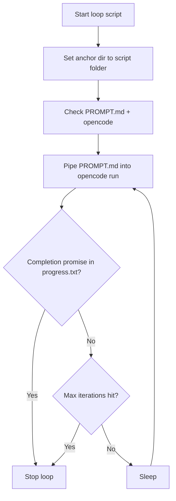

# Ralph Loop Explanation

Ralph Loop is a simple "one task per fresh session" wrapper around OpenCode.
Each iteration pipes `PROMPT.md` into `opencode run`, completes one task, updates
`progress.txt`, and then exits. The wrapper watches for a completion marker and
stops when it appears (or when the iteration limit is hit).

## How the loop works

1) Set working directory to the script folder (anchor directory).
2) Ensure `PROMPT.md` exists and `opencode` is on PATH.
3) Pipe `PROMPT.md` into OpenCode:
   - `Get-Content -Raw PROMPT.md | opencode run --model zai-coding-plan/glm-4.7 "Read and follow the prompt below."`
4) Check `progress.txt` for `<promise>LOOP_COMPLETE</promise>`.
5) Stop if found; otherwise sleep and repeat.

## How to run (PowerShell)

- Default (10 iterations):
  - `.\loop.ps1`
- Infinite loop:
  - `.\loop.ps1 -MaxIterations -1`
- Change model:
  - `.\loop.ps1 -Model zai-coding-plan/glm-4.7`
- Change delay:
  - `.\loop.ps1 -SleepSecs 5`

## How to run (Bash)

- Default (10 iterations):
  - `MAX_ITERATIONS=10 bash loop.sh`
- Infinite loop:
  - `MAX_ITERATIONS=-1 bash loop.sh`
- Change model:
  - `OPENCODE_MODEL=zai-coding-plan/glm-4.7 bash loop.sh`

## Default settings and overrides

- Default loop count: 10
- Infinite loop: `-1`
- Default delay: 2 seconds
- Default model: `zai-coding-plan/glm-4.7`
- Env overrides:
  - `OPENCODE_MODEL` overrides the model used by both scripts
  - `OPENCODE_TEST_HOME` (optional) to isolate OpenCode state; defaults to `.opencode-home` in the anchor dir

## Required files (anchor directory)

- `PROMPT.md` — The instruction set injected every iteration.
- `PRD.md` — The actual product requirements document.
- `IMPLEMENTATION_PLAN.md` — The prioritized, stepwise implementation plan.
- `progress.txt` — The running log; use local PC time (not UTC) for timestamps; include `<promise>LOOP_COMPLETE</promise>` to end the loop.

## Templates and helpers

- `PRD_template.md` — Blank PRD outline.
- `IMPLEMENTATION_PLAN_template.md` — Blank plan outline.
- `kickstart.md` — Question-driven prompt to generate `PRD.md` and `IMPLEMENTATION_PLAN.md`.
- `opencode.json` — Optional local config (model/provider).

## Kickstart flow (generate PRD + plan)

1) Run OpenCode with Kickstart and your idea, for example:
   - `opencode run "@kickstart.md I want to build a gym website"`
2) Answer the questions.
3) The assistant produces:
   - `PRD.md`
   - `IMPLEMENTATION_PLAN.md`
4) Start the loop with `.\loop.ps1` or `bash loop.sh`.

## Folder structure (anchor directory)

All reads/writes are relative to the directory where you run the loop.

Minimal (loop-only):

```
my-ralph/
  loop.ps1
  loop.sh
  PROMPT.md
  PRD.md
  IMPLEMENTATION_PLAN.md
  progress.txt
  kickstart.md
  PRD_template.md
  IMPLEMENTATION_PLAN_template.md
  opencode.json
  ralph_loop_explanation.md
```

With a project folder:

```
my-ralph/
  loop.ps1
  loop.sh
  PROMPT.md
  PRD.md
  IMPLEMENTATION_PLAN.md
  progress.txt
  kickstart.md
  PRD_template.md
  IMPLEMENTATION_PLAN_template.md
  opencode.json
  ralph_loop_explanation.md
  project/
    src/
      features/
        example-feature/
          ...

## Feature code layout (recommended, adjust per stack)

The loop is stack-agnostic. Pick a structure and make sure the PRD + plan match it.
One simple pattern:

- `project/src/`
  - `features/<feature-name>/` — Feature-specific UI, logic, tests
  - `shared/` — Shared UI, utilities, types
  - `app/` or `pages/` — App entry points and routing
```
## Diagram


